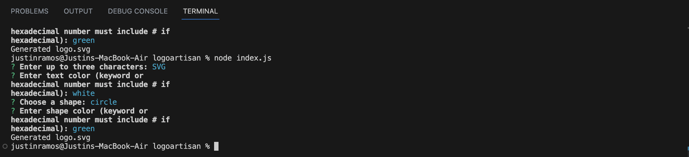
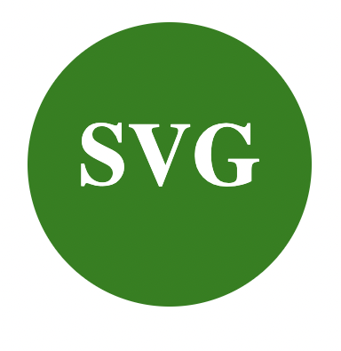

# logoartisan

## Description
this backend progam is to create a logo with 3 characters or more with either a circle, triangle, or square. Use node index.js and anwsers question to generate image.

Video demo https://drive.google.com/file/d/17TxMZFOkqGD9D8l4sLo1Ix5cTaLqXe1G/view

video demo of tests https://drive.google.com/file/d/1x3rFMqO0CHtySp6Dz6Zhlj1EvQzWK5wH/view

## Usage
use npm install inquier ^8.2.6
then use node index.js
## Test
use npm run test to test code from shapes.js
## Images

## Credits
Justin
## License
MIT